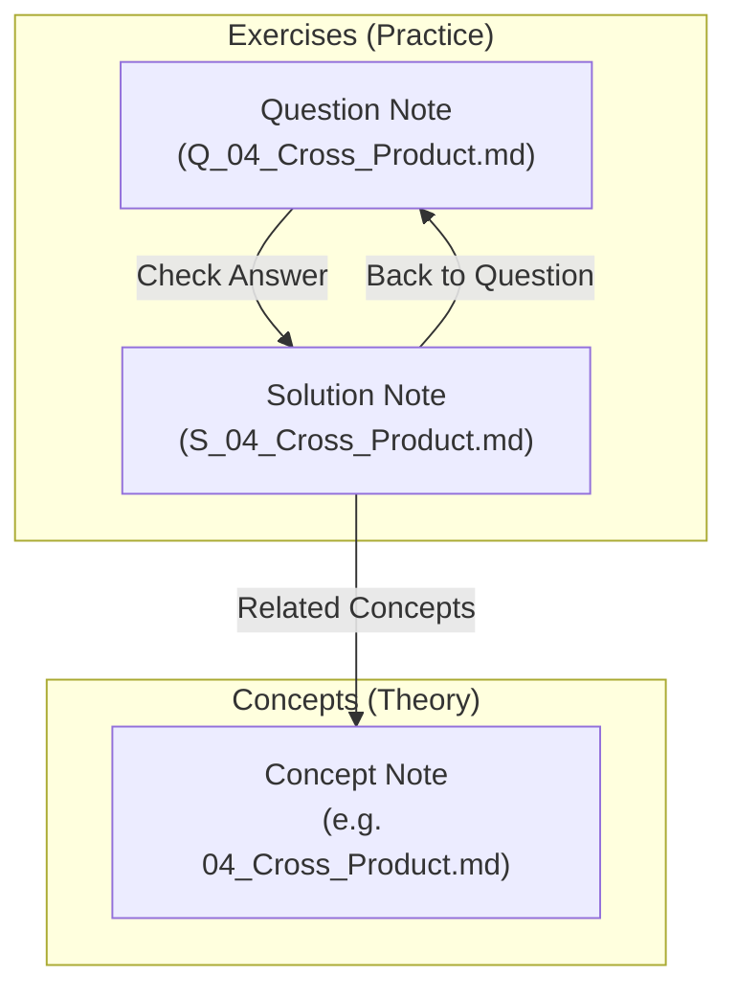

# The Knowledge Graph

The point of this vault is not the notes. It is the links between them.

---

## The exercise chain

Every exercise is bound to its theory by a bidirectional chain:

1. **Question notes** state the problem and link forward to their solution.
2. **Solution notes** give the full derivation, link back to the question, and point at the concept note the exercise came from.
3. **Concept notes** carry the theory, and link onward to every other concept they depend on.

As practice accumulates, solved problems cluster around the concepts they exercise. Graph View then shows at a glance which areas have actually been drilled and which are still theory-only — which is information you cannot get from a file listing.

---

## Why questions and solutions are separate files

Keeping them in one file would be simpler to write and useless to study from: the answer would always be one scroll away. Separation makes it possible to attempt a problem honestly, and the **Check Answer** link makes verification one click rather than a search.

It also means the randomizer can transclude questions into a practice note without dragging the answers along.

---

## Cross-domain linking

The rule is: whenever a note references a subject that already has its own note *anywhere* in the vault, link the first mention.

This matters most across domains. A note on data-oriented design that mentions SIMD should point at the SIMD subject; one that mentions ECS should point at engine architecture. Those links are what turn eleven separate reading lists into one connected body of knowledge.

Links to roadmaps are legitimate too. A roadmap is a real file, and pointing at one signals *"this topic is planned there"* — useful both as navigation and as a marker of where the material will eventually live.

---

## What to link, and what not to

Link the **first meaningful mention**, not every occurrence. A note that links the same concept eight times is noisier, not better connected.

Never link a note's own subject back to itself.

Be conservative with generic words. `cross product`, `homogeneous coordinates` and `scalar triple product` are unambiguous references. `rotation`, `plane` and `scale` appear constantly in ordinary prose, and linking every instance produces a graph where everything connects to everything, which carries no information at all.
