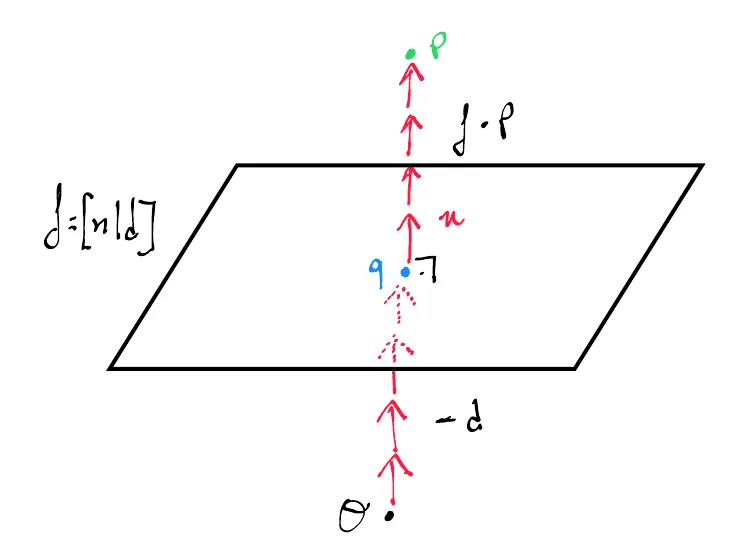

# Distance Between a Point and a Plane

To normalize a plane $\mathbf{f} = [\mathbf{n} \mid d]$, we multiply $s = \frac{1}{\|\mathbf{n}\|}$ to all 4 components:

$$
\mathbf{f}_{\text{normalized}} = \frac{\mathbf{f}}{\|\mathbf{n}\|} = \left[ \frac{n_x}{\|\mathbf{n}\|}, \frac{n_y}{\|\mathbf{n}\|}, \frac{n_z}{\|\mathbf{n}\|}, \frac{d}{\|\mathbf{n}\|} \right]
$$

Only the first 3 components ($n_x, n_y, n_z$) end up having unit length ($\|\hat{n}\| = 1$).

The advantage of having a normalized plane $\mathbf{f}$ is that the [[02_Dot_Product|dot product]] $\mathbf{f} \cdot \mathbf{p}$ is equal to the **signed perpendicular distance** between the plane and the point $\mathbf{p}$.

When $\mathbf{n}$ has unit length, the dot product $\mathbf{n} \cdot \mathbf{p}$ is equal to the length of the projection of $\mathbf{p}$ onto $\mathbf{n}$.

---

	

---

## Signed Perpendicular Distance

The signed perpendicular distance between a point $\mathbf{p}$ and a normalized plane $\mathbf{f} = [\hat{n} \mid d]$ is given by $\mathbf{f} \cdot \mathbf{p}$.

This can be understood as the difference between:
1. The perpendicular distance from point $\mathbf{p}$ to the origin $\mathcal{O}$.
2. The perpendicular distance from a point $\mathbf{q}$ in the plane to the origin $\mathcal{O}$.

The perpendicular distances are calculated by projecting onto the [[02_Normal_Vectors|normal vector]] so that the difference becomes:

$$
\mathbf{n} \cdot \mathbf{p} - \mathbf{n} \cdot \mathbf{q} = \mathbf{n} \cdot \mathbf{p} + d
$$

* The value of **$\mathbf{f} \cdot \mathbf{p}$** corresponds to the number of normal vectors that fit between the plane and the point $\mathbf{p}$.
* The value of **$-d$** corresponds to the number of normal vectors needed to reach the plane itself from the origin $\mathcal{O}$.

---

## Code Implementation

* **C++ Source Code:** [[03_Code/05_Geometry/Distance_Point_and_Plane.cppm|Distance_Point_and_Plane.cppm]]
