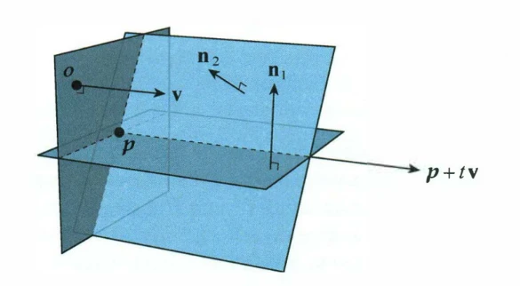

# Intersection of Two Planes

Two **non-parallel** planes $[\mathbf{n}_1 \mid d_1]$ and $[\mathbf{n}_2 \mid d_2]$ intersect at a **line** that is contained in both planes.

To express this line in the [parametric form](03_Lines_and_Rays.md) $L(t) = \mathbf{p} + t\mathbf{v}$, we need to find any starting point $\mathbf{p}$ on the line and the direction $\mathbf{v}$ to which the line runs parallel.

---

## The Direction Vector

Fortunately, the direction $\mathbf{v}$ is easily calculated:

$$
\mathbf{v} = \mathbf{n}_1 \times \mathbf{n}_2
$$

It is so because the line lies inside both planes at once, so its direction must be **perpendicular to both [normal vectors](02_Normal_Vectors.md)** — and the [cross product](../02_Vectors/04_Cross_Product.md) produces exactly the vector orthogonal to the two operands.

---

## Finding a Point on the Line

The point $\mathbf{p}$ can be calculated by introducing a **third plane** $[\mathbf{v} \mid 0]$, containing the origin $\mathcal{O}$. 

	

Solving the problem of a [three-plane intersection](08_Intersection_Three_Planes.md) is how to find $\mathbf{p}$.

Setting $\mathbf{n}_3 = \mathbf{v}$ and $d_3 = 0$, the system becomes:

$$
\begin{bmatrix} \leftarrow & \mathbf{n}_1 & \rightarrow \\\\ \leftarrow & \mathbf{n}_2 & \rightarrow \\\\ \leftarrow & \mathbf{n}_3 & \rightarrow \end{bmatrix} \mathbf{p} = \begin{bmatrix} -d_1 \\\\ -d_2 \\\\ 0 \end{bmatrix}
$$

And solving for $\mathbf{p}$:

$$
\mathbf{p} = \frac{d_1(\mathbf{v} \times \mathbf{n}_2) + d_2(\mathbf{n}_1 \times \mathbf{v})}{\mathbf{v}^2}
$$

This formula returns both the point $\mathbf{p}$ (the three-plane intersection) and the direction $\mathbf{v}$, which together define the line completely.

### Why the Third Term Disappears

The general three-plane solution carries a third term $d_3(\mathbf{n}_2 \times \mathbf{n}_1)$. Choosing a plane that passes through the origin sets $d_3 = 0$, which annihilates that term and leaves only two.

### Why the Denominator is $\mathbf{v}^2$

The three-plane denominator is the [scalar triple product](../02_Vectors/05_Scalar_Triple_Product.md) $[\mathbf{n}_1, \mathbf{n}_2, \mathbf{n}_3]$. Substituting $\mathbf{n}_3 = \mathbf{v}$ and using the cyclic property of the triple product:

$$
[\mathbf{n}_1, \mathbf{n}_2, \mathbf{v}] = \mathbf{v} \cdot (\mathbf{n}_1 \times \mathbf{n}_2) = \mathbf{v} \cdot \mathbf{v} = \mathbf{v}^2
$$

The [determinant](../03_Matrices/03_Determinants.md) collapses into a plain squared length precisely because the third normal *was chosen to be* $\mathbf{n}_1 \times \mathbf{n}_2$.

---

## Which Point on the Line You Get

A line has infinitely many valid starting points, so $\mathbf{p}$ is not unique — but this construction returns a specific, meaningful one. Because $\mathbf{p}$ lies in the plane $[\mathbf{v} \mid 0]$, it satisfies:

$$
\mathbf{v} \cdot \mathbf{p} = 0
$$

so $\mathbf{p}$ is perpendicular to the line's own direction. Of all the points along the line, the one whose position vector is perpendicular to the direction is the point **closest to the origin**. Travelling any distance $t$ away from it only adds a component along $\mathbf{v}$, which strictly increases the distance:

$$
\|\mathbf{p} + t\mathbf{v}\|^2 = \|\mathbf{p}\|^2 + t^2\mathbf{v}^2
$$

This makes the result stable and canonical, rather than an arbitrary point that happens to fall out of the algebra.

---

## Degenerate Case: Parallel Planes

If the two normals are parallel, their cross product vanishes:

$$
\mathbf{v} = \mathbf{n}_1 \times \mathbf{n}_2 = \mathbf{0} \implies \mathbf{v}^2 = 0
$$

and the formula divides by zero. As with the [line-plane intersection](07_Intersection_Line_and_Plane.md), the vanishing denominator hides two geometrically different situations:

| Condition | Meaning |
| :--- | :--- |
| $\mathbf{v}^2 \neq 0$ | The planes meet in exactly one line |
| $\mathbf{v}^2 = 0$, planes **distinct** | Parallel planes sitting at different offsets — **no intersection** |
| $\mathbf{v}^2 = 0$, planes **coincident** | The same plane written twice — the intersection is the **entire plane**, not a line |

The two singular cases are distinguished by whether $[\mathbf{n}_2 \mid d_2]$ is a scalar multiple of $[\mathbf{n}_1 \mid d_1]$ across **all four** components. Matching normals alone is not enough: it is the $d$ components that decide whether the planes are stacked apart or lying on top of one another.

Any implementation must therefore test $\mathbf{v}^2$ before dividing, and in floating-point code that test belongs behind an epsilon comparison rather than an exact zero check.

---

## Code Implementation

* **C++ Source Code:** [Intersection_Two_Planes.cppm](../../03_Code/05_Geometry/Intersection_Two_Planes.cppm)
