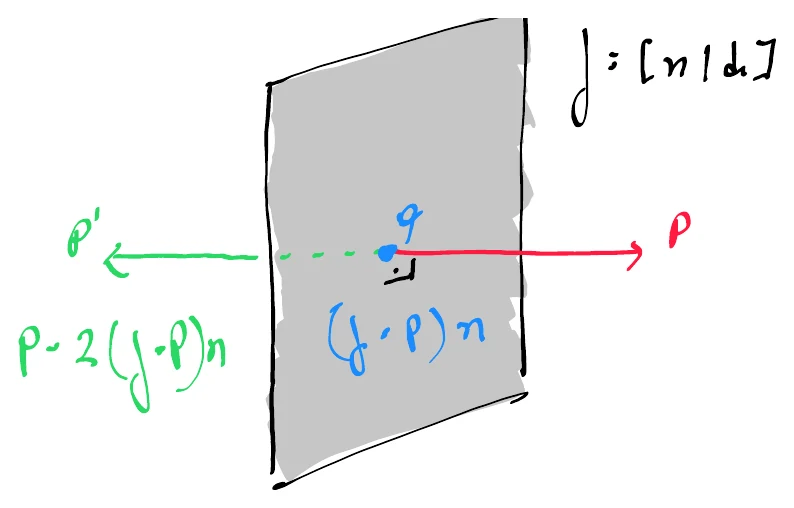

# Reflection Through a Plane

When a point $\mathbf{p}$ gets reflected through a plane, the result is a new point $\mathbf{p}'$ that lies at the same distance from the plane compared to $\mathbf{p}$, but on the opposite side.

The line connecting $\mathbf{p}'$ to $\mathbf{p}$, passing through the plane, is **parallel to the plane's [normal vector](02_Normal_Vectors.md)**.

Let $\mathbf{f} = [\mathbf{n} \mid d]$ be the plane, such that $\mathbf{n}$ has unit length, and let $\mathbf{q}$ be the point closest to $\mathbf{p}$ lying in the plane.

---

	

---

## The Closest Point in the Plane

The difference between $\mathbf{p}$ and $\mathbf{q}$ is $(\mathbf{f} \cdot \mathbf{p})\mathbf{n}$, because the scalar quantity $\mathbf{f} \cdot \mathbf{p}$ is the [perpendicular distance](05_Distance_Point_and_Plane.md) between the plane $\mathbf{f}$ and the point $\mathbf{p}$.

When this vector is subtracted from $\mathbf{p}$, the result is the point $\mathbf{q}$:

$$
\mathbf{q} = \mathbf{p} - (\mathbf{f} \cdot \mathbf{p})\mathbf{n}
$$

A **second subtraction** of this vector produces the reflection point $\mathbf{p}'$, that is just as far away from the plane as the original point $\mathbf{p}$, but on the opposite side:

$$
\mathbf{p}' = \mathbf{p} - 2(\mathbf{f} \cdot \mathbf{p})\mathbf{n}
$$

---

## Proof: Why $\mathbf{f} \cdot \mathbf{p}$ is the Signed Distance

The plane $\mathbf{f} = [\mathbf{n} \mid d]$ means it is the set of points $\mathbf{x}$ satisfying:

$$
\mathbf{n} \cdot \mathbf{x} + d = 0
$$

A point $\mathbf{p} = (p_x, p_y, p_z, 1)$ in [homogeneous coordinates](../04_Transforms/07_Homogeneous_Coordinates.md) gives the 4D [dot product](../02_Vectors/02_Dot_Product.md) $\mathbf{f} \cdot \mathbf{p}$, which represents the signed distance of $\mathbf{p}$ compared to the plane:

$$
\mathbf{f} \cdot \mathbf{p} = \mathbf{n} \cdot \mathbf{p} + d
$$

$\mathbf{p}$ is a point $\mathbf{q}$ (where $\mathbf{q}$ is located at the plane) that traveled a distance $t$ along the normal:

$$
\mathbf{p} = \mathbf{q} + t\mathbf{n}
$$

Now we can plug it into our formula:

$$
\mathbf{f} \cdot \mathbf{p} = \mathbf{n} \cdot (\mathbf{q} + t\mathbf{n}) + d
$$

$$
\mathbf{f} \cdot \mathbf{p} = (\mathbf{n} \cdot \mathbf{q} + d) + t(\mathbf{n} \cdot \mathbf{n})
$$

$$
\mathbf{f} \cdot \mathbf{p} = 0 + t \cdot 1
$$

$$
\mathbf{f} \cdot \mathbf{p} = t
$$

Where the two terms collapse because:

* $\mathbf{n} \cdot \mathbf{q} + d$ is $0$, because $\mathbf{q}$ is on the plane.
* $\mathbf{n} \cdot \mathbf{n}$ is $1$, because $\mathbf{n}$ is of unit length.

Therefore, $\mathbf{f} \cdot \mathbf{p}$ is the **signed distance** from the plane to $\mathbf{p}$.

---

## Deriving $\mathbf{q}$ and $\mathbf{p}'$

Since we know that $(\mathbf{f} \cdot \mathbf{p})\mathbf{n} = \mathbf{p} - \mathbf{q}$, we can reorganize such that:

$$
-\mathbf{q} = (\mathbf{f} \cdot \mathbf{p})\mathbf{n} - \mathbf{p}
$$

$$
\mathbf{q} = \mathbf{p} - (\mathbf{f} \cdot \mathbf{p})\mathbf{n}
$$

$(\mathbf{f} \cdot \mathbf{p})\mathbf{n}$ is a vector of length $t$ pointing along the normal to $\mathbf{q}$.

If we continue the subtraction, we get $\mathbf{p}'$:

$$
\mathbf{p}' = \mathbf{p} - 2(\mathbf{f} \cdot \mathbf{p})\mathbf{n}
$$

---

## The $4 \times 4$ Reflection Matrix

A $4 \times 4$ matrix transformation corresponding to the reflection through a plane can be determined by regarding $\mathbf{n}$ as a 4D column vector with a $w$ coordinate of zero, so the above formula can be rewritten as:

$$
\mathbf{p}' = \mathbf{p} - 2(\mathbf{f} \cdot \mathbf{p})\mathbf{n} = (\mathbf{I}_4 - 2\mathbf{n} \otimes \mathbf{f})\mathbf{p}
$$

Which expands into:

$$
\mathbf{H}_{\text{reflect}}(\mathbf{f}) = \begin{bmatrix} 1 - 2n_x^2 & -2n_x n_y & -2n_x n_z & -2n_x d \\\\ -2n_x n_y & 1 - 2n_y^2 & -2n_y n_z & -2n_y d \\\\ -2n_x n_z & -2n_y n_z & 1 - 2n_z^2 & -2n_z d \\\\ 0 & 0 & 0 & 1 \end{bmatrix}
$$

---

## Code Implementation

* **C++ Source Code:** [Reflection_Through_Plane.cppm](../../../../90_Code/05_Geometry/Reflection_Through_Plane.cppm)
