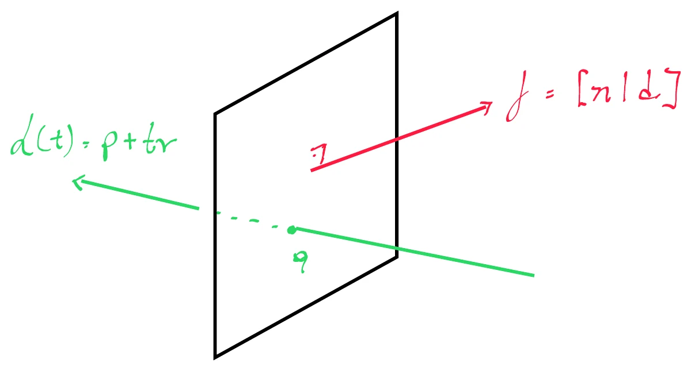

# Intersection of a Line and a Plane

Let $\mathbf{f} = [\mathbf{n} \mid d]$ be the plane, and let $L(t) = \mathbf{p} + t\mathbf{v}$ be a [parametric line](03_Lines_and_Rays.md), such that:

$$
\mathbf{n} \cdot \mathbf{v} \neq 0
$$

which signifies that the line is **not parallel** to the plane.

We can find the point $\mathbf{q}$, where $L$ intersects with $\mathbf{f}$, when $t$ satisfies:

$$
\mathbf{f} \cdot L(t) = 0
$$

This is simply the [implicit plane equation](04_Planes.md) applied to the line: a point lies on the plane exactly when its 4D [dot product](../02_Vectors/02_Dot_Product.md) with $\mathbf{f}$ vanishes, so we ask which value of $t$ drives the line's position onto the plane.

---

	

---

## Solving for the Parameter $t$

Substituting the line equation and distributing the dot product over the sum:

$$
\mathbf{f} \cdot (\mathbf{p} + t\mathbf{v}) = 0
$$

$$
(\mathbf{f} \cdot \mathbf{p}) + t(\mathbf{f} \cdot \mathbf{v}) = 0
$$

Isolating $t$:

$$
t = -\frac{\mathbf{f} \cdot \mathbf{p}}{\mathbf{f} \cdot \mathbf{v}}
$$

Where the two dot products are **not** the same kind of operation:

* $\mathbf{f} \cdot \mathbf{p}$ is a **4D calculation**, because $\mathbf{p}$ is a position and carries $w = 1$, so it picks up the constant $d$.
* $\mathbf{f} \cdot \mathbf{v}$ is effectively a **3D calculation**, because $\mathbf{v}$ is a direction and carries $w = 0$, so the $d$ term drops out entirely and it reduces to $\mathbf{n} \cdot \mathbf{v}$.

This is why the non-parallel condition is stated as $\mathbf{n} \cdot \mathbf{v} \neq 0$: it is exactly the condition $\mathbf{f} \cdot \mathbf{v} \neq 0$ that keeps the denominator from vanishing. See [Homogeneous Coordinates](../04_Transforms/07_Homogeneous_Coordinates.md) for why $w = 0$ makes a direction immune to the translation term.

---

## The Intersection Point

Plugging $t$ back into the line equation, we have:

$$
\mathbf{q} = \mathbf{p} - \frac{\mathbf{f} \cdot \mathbf{p}}{\mathbf{f} \cdot \mathbf{v}}\mathbf{v}
$$

This is the point that intersects with plane $\mathbf{f}$ at point $\mathbf{q}$.

> [!NOTE]
> **The plane does not need to be normalized.** Scaling $\mathbf{f}$ by any factor $s$ scales both $\mathbf{f} \cdot \mathbf{p}$ and $\mathbf{f} \cdot \mathbf{v}$ by that same $s$, and the ratio cancels it out. Unlike the [point-plane distance](05_Distance_Point_and_Plane.md), which measures a physical length and therefore requires $\|\mathbf{n}\| = 1$, this calculation only asks *where* along the line the crossing happens — a scale-invariant question.

---

## Degenerate Cases: When the Line is Parallel

When $\mathbf{f} \cdot \mathbf{v} = 0$, the direction vector is perpendicular to the normal, so the line runs parallel to the plane and the formula divides by zero. The value of $\mathbf{f} \cdot \mathbf{p}$ then distinguishes two geometrically different situations:

| Condition | Meaning |
| :--- | :--- |
| $\mathbf{f} \cdot \mathbf{v} \neq 0$ | Exactly one intersection point, at $t = -\dfrac{\mathbf{f} \cdot \mathbf{p}}{\mathbf{f} \cdot \mathbf{v}}$ |
| $\mathbf{f} \cdot \mathbf{v} = 0$ and $\mathbf{f} \cdot \mathbf{p} \neq 0$ | **No intersection** — the line is parallel and sits off the plane |
| $\mathbf{f} \cdot \mathbf{v} = 0$ and $\mathbf{f} \cdot \mathbf{p} = 0$ | **Infinitely many intersections** — the line lies entirely *within* the plane |

Any implementation must test the denominator before dividing.

---

## Restricting the Intersection to Rays

If $L(t)$ is a **ray** rather than an infinite line, we can impose the condition that the intersection only occurs if:

$$
t \ge 0
$$

Otherwise the intersection sits behind the ray's start position, meaning the ray points away from the plane and never reaches it.

We can also verify whether the ray starts **in front of** the plane, which $\mathbf{f} \cdot \mathbf{p} > 0$ determines. For a ray starting in front to produce a positive value of $t$, we must also have:

$$
\mathbf{f} \cdot \mathbf{v} < 0
$$

so that the ray is pointing back toward the front face of the plane. The signs are consistent with the formula: a positive numerator $\mathbf{f} \cdot \mathbf{p}$ over a negative denominator $\mathbf{f} \cdot \mathbf{v}$ yields $t = -\frac{(+)}{(-)} > 0$.

> [!IMPORTANT]
> **Why this matters in engines:** this pair of tests is the core of ray casting. The $\mathbf{f} \cdot \mathbf{v} < 0$ check is precisely a **backface cull** — it rejects surfaces whose front side faces away from the ray — and the $t \ge 0$ check discards intersections behind the ray origin. Together they reduce a full intersection test to two sign checks before any division is performed.

---

## Code Implementation

* **C++ Source Code:** [Intersection_Line_and_Plane.cppm](../../../../90_Code/05_Geometry/Intersection_Line_and_Plane.cppm)
