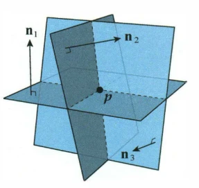
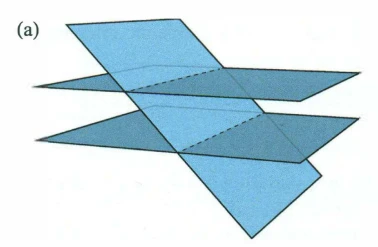
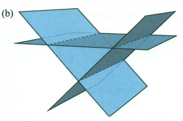

# Intersection of Three Planes

Let $[\mathbf{n}_1 \mid d_1]$, $[\mathbf{n}_2 \mid d_2]$ and $[\mathbf{n}_3 \mid d_3]$ be planes.

So long as the [normal vectors](02_Normal_Vectors.md) $\mathbf{n}_1$, $\mathbf{n}_2$ and $\mathbf{n}_3$ are **linearly independent**, the planes intersect at a single point $\mathbf{p}$ in space.

	

---

## Building the Linear System

Since this point lies in the three planes, we know that:

$$
[\mathbf{n}_i \mid d_i] \cdot \mathbf{p} = 0 \quad \text{for } i = 1, 2, 3
$$

Expanding the 4D [dot product](../02_Vectors/02_Dot_Product.md) and isolating the constant gives one scalar equation per plane:

$$
\mathbf{n}_i \cdot \mathbf{p} + d_i = 0 \implies \mathbf{n}_i \cdot \mathbf{p} = -d_i
$$

Stacking the three equations, with each normal forming one **row** of the matrix:

$$
\begin{bmatrix} n_{1x} & n_{1y} & n_{1z} \\\\ n_{2x} & n_{2y} & n_{2z} \\\\ n_{3x} & n_{3y} & n_{3z} \end{bmatrix} \mathbf{p} = \begin{bmatrix} -d_1 \\\\ -d_2 \\\\ -d_3 \end{bmatrix}
$$

Now it becomes a [linear system](../01_Systems_of_Equations/01_Linear_Systems.md) of type:

$$
\mathbf{A}\mathbf{p} = \mathbf{b}
$$

---

## Notation: The Bracket Form

$[\mathbf{n}_1, \mathbf{n}_2, \mathbf{n}_3]$ is shorthand for the [scalar triple product](../02_Vectors/05_Scalar_Triple_Product.md) — a single **scalar**, despite the brackets:

$$
[\mathbf{n}_1, \mathbf{n}_2, \mathbf{n}_3] = (\mathbf{n}_1 \times \mathbf{n}_2) \cdot \mathbf{n}_3 = \mathbf{n}_1 \cdot (\mathbf{n}_2 \times \mathbf{n}_3) = \det \mathbf{A}
$$

Cyclic rotation of the arguments leaves the value unchanged, so the [cross product](../02_Vectors/04_Cross_Product.md) may sit on either side; the shorthand avoids committing to one grouping. Because it equals $\det \mathbf{A}$, dividing by it below is dividing by the [determinant](../03_Matrices/03_Determinants.md).

---

## When a Unique Solution Exists

The behaviour of the system is decided entirely by whether $\mathbf{A}$ is invertible:

* **If $\mathbf{A}$ is invertible ($\det \neq 0$):** the three normals are linearly independent, so the planes are not stacked into a degenerate arrangement, and there is exactly **one intersection point**.
* **If $\mathbf{A}$ is NOT invertible ($\det = 0$):** the normals are **linearly dependent**; two or three of the planes are parallel, or their normals all lie in a common plane. There is **no unique solution** — the system may have no solution at all, or infinitely many.

The two degenerate outcomes are geometrically distinct. In the first, the planes meet pairwise in three *parallel* lines, forming a prism-like arrangement with no point common to all three:

	

In the second, all three planes share a **common line**, so every point along that line is an intersection — infinitely many solutions:

	

> [!NOTE]
> $\det \mathbf{A}$ is exactly the scalar triple product $[\mathbf{n}_1, \mathbf{n}_2, \mathbf{n}_3]$, which measures the **volume of the parallelepiped** spanned by the three normals. A volume of zero means the three normals are coplanar — they no longer span 3D space, and so they cannot pin down a single point in it.

---

## Solving for $\mathbf{p}$

Granting $\mathbf{A}$ is invertible, we can solve for $\mathbf{p}$ by multiplying both sides by $\mathbf{A}^{-1}$. For a matrix whose *rows* are $\mathbf{n}_1, \mathbf{n}_2, \mathbf{n}_3$, the [inverse](../03_Matrices/04_Matrix_Inversion.md) is the matrix whose *columns* are the cross products of the other two normals, scaled by the reciprocal of the determinant:

$$
\mathbf{A}^{-1} = \frac{1}{[\mathbf{n}_1, \mathbf{n}_2, \mathbf{n}_3]} \begin{bmatrix} \uparrow & \uparrow & \uparrow \\\\ \mathbf{n}_2 \times \mathbf{n}_3 & \mathbf{n}_3 \times \mathbf{n}_1 & \mathbf{n}_1 \times \mathbf{n}_2 \\\\ \downarrow & \downarrow & \downarrow \end{bmatrix}
$$

Multiplying this by $\mathbf{b} = (-d_1, -d_2, -d_3)$ scales each column by its corresponding entry, and every term arrives carrying a minus sign:

$$
\mathbf{p} = \frac{-d_1(\mathbf{n}_2 \times \mathbf{n}_3) - d_2(\mathbf{n}_3 \times \mathbf{n}_1) - d_3(\mathbf{n}_1 \times \mathbf{n}_2)}{[\mathbf{n}_1, \mathbf{n}_2, \mathbf{n}_3]}
$$

Therefore:

$$
\mathbf{p} = \frac{d_1(\mathbf{n}_3 \times \mathbf{n}_2) + d_2(\mathbf{n}_1 \times \mathbf{n}_3) + d_3(\mathbf{n}_2 \times \mathbf{n}_1)}{[\mathbf{n}_1, \mathbf{n}_2, \mathbf{n}_3]}
$$

The order of the factors in each cross product has been **reversed** to cancel the minus sign. This works because the cross product is anti-commutative:

$$
\mathbf{a} \times \mathbf{b} = -(\mathbf{b} \times \mathbf{a})
$$

so swapping the two operands absorbs the negation directly into the term, leaving a formula with no leading minus signs to track.

---

## Code Implementation

* **C++ Source Code:** [Intersection_Three_Planes.cppm](../../../../90_Code/05_Geometry/Intersection_Three_Planes.cppm)
