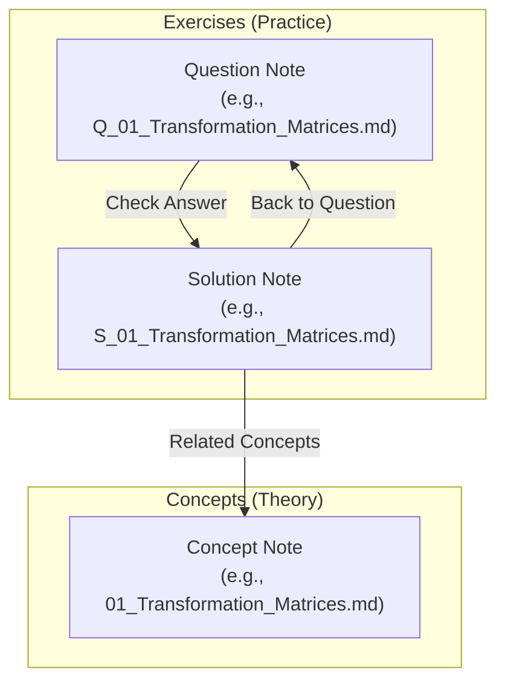

# Game Engine Mathematics & Systems Study Repository

A growing knowledge base covering the mathematics and systems behind game and rendering engines. It is designed to integrate seamlessly with **Obsidian** while remaining fully readable on **GitHub**, utilizing relative markdown cross-links (`[Label](relative/path.md)`) and tags to build a visual, highly connected graph of theoretical concepts, programming implementations, and practice exercises.

The vault is organized **domain first**: each top-level numbered folder is a domain (Mathematics, Rendering, Physics, …), each domain holds subjects, and every subject carries its own `Concepts/`, `Exercises/` and `Assets/`. Adding a new domain is a single folder, and cross-domain links (for example a rendering note pointing at a linear algebra proof) stay inside one graph.

Domains that have not been started yet contain only a `00_Roadmap.md` — a scoped study plan naming the subjects to cover, what to deliberately skip, and the resources worth using. They gain `Concepts/`, `Exercises/` and `Assets/` folders as work begins.

> **Note on link format:** links use standard markdown with relative paths rather than Obsidian `[[wikilinks]]`, because wikilinks render as raw text on GitHub. Relative markdown links resolve correctly in both Obsidian (including Graph View) and GitHub.

---

## Repository Structure

Numbered prefixes keep a deliberate order in the file explorer. Domains occupy `01`–`89`; tooling and shared resources sit at `90`+:

```text
engine-knowledge/
├── 01_Mathematics/                    # DOMAIN
│   └── 01_Linear_Algebra/             #   SUBJECT
│       ├── Concepts/                  #     Theoretical notes, grouped by topic
│       │   ├── 01_Systems_of_Equations/
│       │   ├── 02_Vectors/            # e.g., Dot Product, Cross Product, Projections
│       │   ├── 03_Matrices/
│       │   ├── 04_Transforms/         # e.g., Rotations, Reflections, Quaternions
│       │   └── 05_Geometry/           # e.g., Planes, Normal Vectors, Intersections
│       ├── Exercises/                 #     Questions and step-by-step solutions
│       │   ├── 01_Systems_of_Equations/
│       │   │   ├── Questions/         # md files named: Q_[Exercise_Name].md
│       │   │   └── Solutions/         # md files named: S_[Exercise_Name].md
│       │   └── ... 05_Geometry/
│       └── Assets/                    #     Diagrams and figures embedded by the notes
│   └── 00_Roadmap.md               #   Remaining subjects + how much of each to learn
├── 02_Rendering/                      # MVP, rasterization, APIs, shading, shadows
├── 03_Physics/                        # Collision detection, rigid body dynamics
├── 04_Engine_Architecture/            # Game loop, memory, ECS, resources, patterns
├── 05_Data_Structures/                # Spatial structures, cache-aware containers
├── 06_Algorithms/                     # Computational geometry, pathfinding, procedural
├── 07_Concurrency_and_Parallelism/    # Memory model, job systems, lock-free
├── 08_Systems_and_Performance/        # Cache, data-oriented design, SIMD, profiling
├── 09_Tools_and_Pipeline/             # Asset pipeline, serialization, editor tooling
├── 10_Audio/                          # Real-time audio, mixing, spatialization
├── 11_Networking/                     # Transport, state sync, latency hiding
│                                      # Each domain carries a 00_Roadmap.md until work starts
├── 90_Code/                           # One buildable C++23 project, mirroring the topic folders
│   ├── 00_Utils/                      # Shared helpers (float comparison)
│   ├── 01_Systems_of_Equations/ ... 05_Geometry/   # One .cppm per concept note
│   ├── linear_algebra.cppm            # Umbrella module re-exporting every sub-module
│   ├── tests/                         # GoogleTest unit tests, one file per module
│   └── CMakeLists.txt                 # Requires a compiler with `import std;` support
├── 99_Templates/                      # Templates and formatting guides
│   ├── Template_Question.md
│   ├── Template_Solution.md
│   ├── Math_Formatting_Conventions.md # Reference guide for Obsidian & GitHub math syntax
│   └── __template__usage__.md
├── randomizer.py                      # CLI tool to filter questions and scaffold new ones
├── README_Randomizer.md               # Help/Documentation for the CLI tool
├── TODO.md                            # Remaining solution notes and unimplemented code modules
└── README.md                          # This repository-level overview
```

---

## Knowledge Graph & Linking Philosophy

To maximize active recall and build a semantic understanding of each subject, this vault employs a strict **bi-directional linking strategy**:



1. **Question notes (`Q_*.md`)** contain the problem statement (both numerical calculations and conceptual theory in LaTeX). They end with a link to their corresponding solution:
   ```markdown
   **Check Answer:** [S_02_Dot_Product](../Solutions/S_02_Dot_Product.md)
   ```
2. **Solution notes (`S_*.md`)** contain complete, step-by-step mathematical derivations in LaTeX, and an optional code snippet. They link back to the question and **point to the theoretical concept note** in the subject's `Concepts/` folder:
   ```markdown
   **Back to Question:** [Q_02_Dot_Product](../Questions/Q_02_Dot_Product.md) | **Related Concepts:** [02_Dot_Product](../../../Concepts/02_Vectors/02_Dot_Product.md)
   ```
3. **Obsidian Graph View:** This linking strategy ensures that as you practice, all solved problems form "clusters" around their core mathematical concepts, highlighting which areas you've practiced most and creating a physical web of your knowledge.

---

## Daily Workflow

Here is how to get the most out of your repository on a daily basis:

### 1. Daily Practice Session
Spend 15–30 minutes a day solving random exercises using the `randomizer.py` tool.

1. Generate a workspace for today's practice:
   ```bash
   python3 randomizer.py -n 3 --practice
   ```
2. Open **Obsidian** and open the newly created `Daily_Practice.md` in the vault root.
3. Because of **transclusions (`![[Q_...]]`)**, you will see all 3 questions rendered inline inside the single daily practice note!
4. Write down your solutions on paper or scratchpad, then click the **Check Answer** links to instantly verify your derivations.
5. Delete `Daily_Practice.md` when done — it is gitignored, so it is scratch space and never committed.

### 2. Expanding the Repository (Adding Questions)
When you study a new topic or find a good textbook exercise, add it to your database using the CLI scaffolder:

1. Scaffold a question-solution pair under a topic folder:
   ```bash
   python3 randomizer.py vectors --new Projection_Properties --difficulty Medium
   ```
2. Open the new files inside Obsidian (they are pre-filled with frontmatter and bi-directional links).
3. Fill in the exercise description in the **Question** note, and write the mathematical steps in the **Solution** note.
4. Link the solution to its theory concept (e.g. `[06_Vector_Projection](../../../Concepts/02_Vectors/06_Vector_Projection.md)`) to bind it to your knowledge graph.
